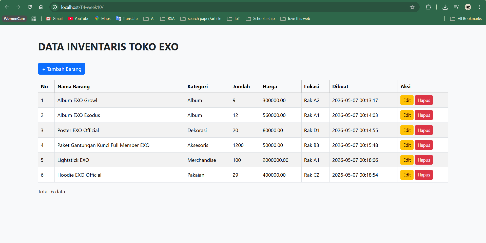
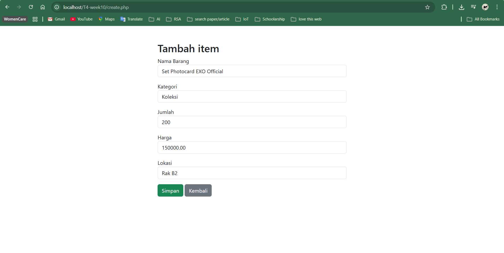
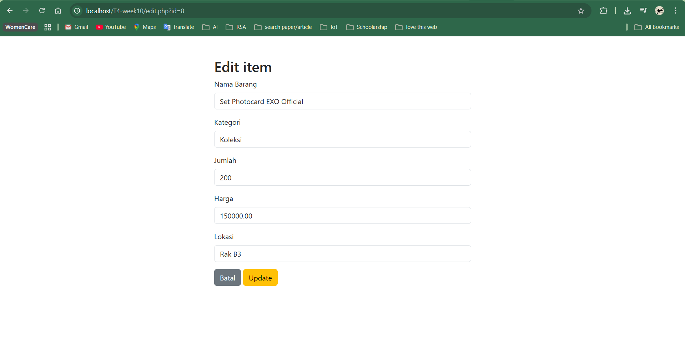
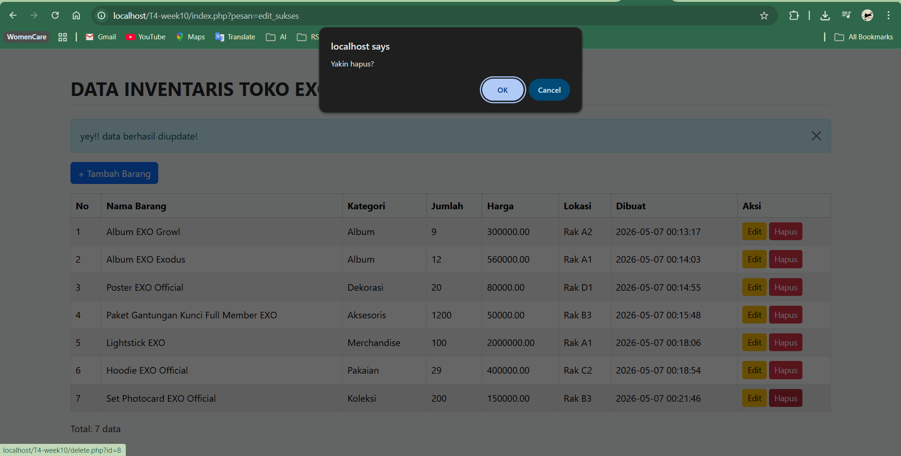
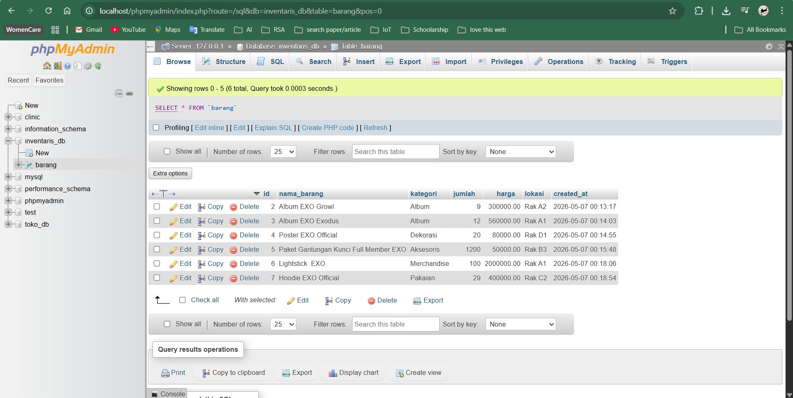

# T4-week10 - Aplikasi CRUD PHP MySQL

Nama  : Qomari Auliyah
NIM   : F1D02410086
Kelas : Pemrograman Web

## Deskripsi
Aplikasi CRUD (Create, Read, Update, Delete) menggunakan PHP, MySQL, dan Bootstrap.

- Database : inventaris_db (sesuai NIM)
- Tabel    : barang (sesuai NIM)

## Cara Menjalankan
1. Import file .sql ke phpMyAdmin
2. Letakkan folder project di htdocs/ (XAMPP)
3. Buka browser ke http://localhost/T4-week10/

## Screenshot

### Daftar Data

### Tambah Data

### Edit Data

### Hapus Data

### Struktur Database (phpMyAdmin)
